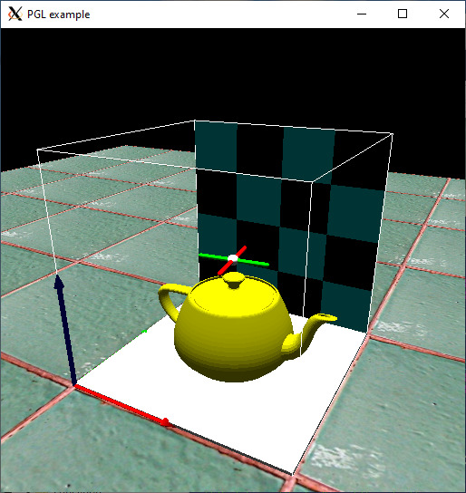

# pgl
[](https://travis-ci.com/wcaarls/pgl)

Primitive OpenGL 3D primitive library

Copyright 2020 Wouter Caarls

Licensed under the Apache License, Version 2.0 (the "License");
you may not use this file except in compliance with the License.
You may obtain a copy of the License at

   http://www.apache.org/licenses/LICENSE-2.0

Unless required by applicable law or agreed to in writing, software
distributed under the License is distributed on an "AS IS" BASIS,
WITHOUT WARRANTIES OR CONDITIONS OF ANY KIND, either express or implied.
See the License for the specific language governing permissions and
limitations under the License.

# Introduction

*When all you want to do is draw some boxes*

Header-only library providing quick and easy drawing of 3D primitives
(box, sphere, cylinder, capsule), a scene graph, and camera controller.

---

**WARNING**

Uses legacy OpenGL functions. Built for ease of use and glx compatibility,
not speed.

---



# Installation (Ubuntu 18.04)
```
sudo apt install git cmake g++ libgl-dev
git clone https://github.com/wcaarls/pgl.git
```

To compile the example, additionally install
```
sudo apt install libglfw3-dev
```
# Setup
```
mkdir build
cd build
cmake ..
make && sudo make install
```

# Documentation

https://wcaarls.github.io/pgl/index.html

See also the [example](src/example.cpp)
